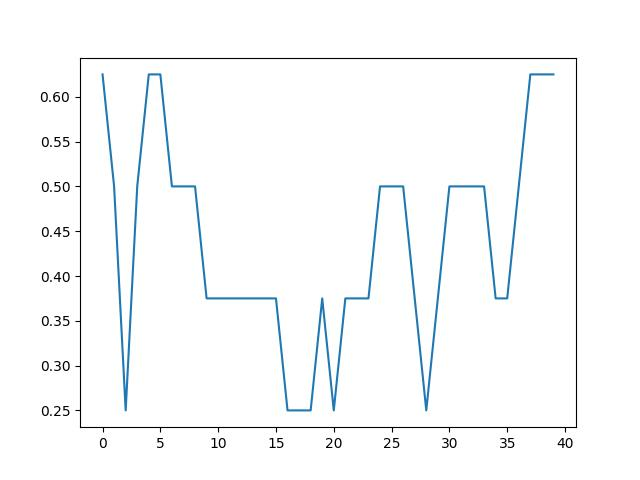
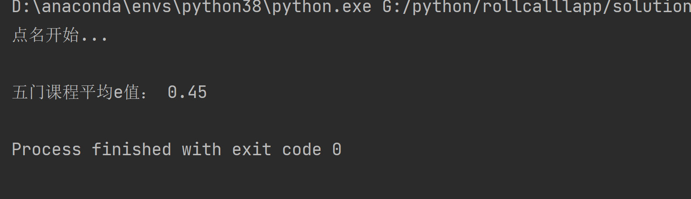
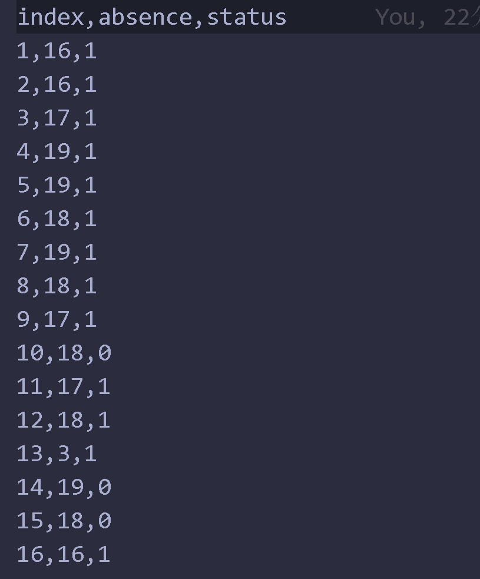

# 环境介绍
运行环境：python3.8
涉及到的第三方库：Numpy,pandas,matplotlib
库的安装操作
` 
pip install xxx
` 
运行main即可得到结果，数据可视化结果:

 
# 运行&操作
## 1.运行代码 

<!-- 运行结果展示 -->

## 2.运行软件 
直接运行 ‘solution_python\main.py’
## 3.测试：
点名名单概览：

# 对于测试结果的分析及算法评价：
优点：
可以较为合理的模拟，缺席的人数范围
有待改善：
点名算法还有所欠缺，数据生成算法中还可以加入一些其他有效特征值，在后期有一定数据基础上可以考虑采用遗传算法等优化模型优化。
# 接口的设置：
接口输入可采用参数直接传入,输出可从指定路径下获取。
